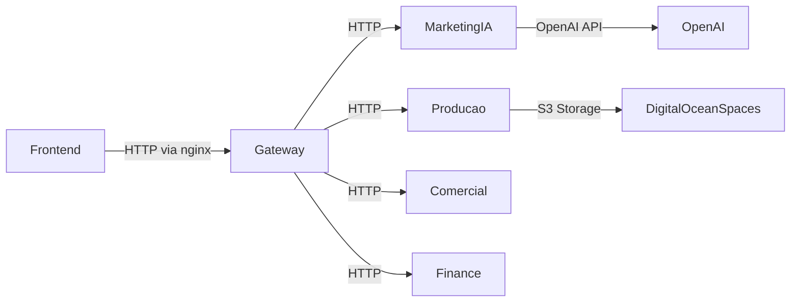

# Resumo da Arquitetura

**Resumo dos Módulos**

1. **backend-gateway**  
   - FastAPI que funciona como gateway entre o frontend e os demais serviços. Possui endpoints para cadastros básicos (empresas, clientes e fornecedores) e repassa chamadas para os outros backends. As URLs dos serviços são lidas das variáveis `MARKETING_IA_BACKEND_URL`, `PRODUCAO_BACKEND_URL` e `COMERCIAL_BACKEND_URL`.  
   - Endpoints principais incluem `/empresa`, `/clientes`, `/fornecedores`, `/usuarios` e rotas de autenticação que delegam ao backend de marketing.  
   - Modelos de dados: `Empresa`, `Cliente` e `Fornecedor` definidos via SQLAlchemy.

2. **marketing-digital-ia/backend**  
   - Serviço FastAPI com rotas de IA (chat, geração de campanhas e publicações) e gestão de usuários.  
   - Depende de OpenAI (chave `OPENAI_API_KEY`) e armazena permissões/grupos de usuários. Variáveis de exemplo em `.env.example`.  
   - Rotas definidas em `routes/` (ex.: `/chat/`, `/nova-campanha/`, `/nova-publicacao/`, `/publicos/`, `/auth/login`, `/usuarios`).  
   - Modelo principal `User` em `db_models.py`.
   - Autenticação JWT implementada em `security.py` utilizando `SECRET_KEY` e `ALGORITHM`.
   - Integração com RD Station via OAuth2 (`/rd/login`, `/rd/callback`) e tabela `rdstation_tokens`.

3. **producao/backend/src**  
   - Grande serviço FastAPI para processamento de lotes de produção e nesting de chapas. Usa DigitalOcean Spaces para armazenamento (`OBJECT_STORAGE_*` variáveis).  
   - Possui múltiplos endpoints para importar arquivos, gerar lotes, executar e visualizar nesting, gerenciar chapas e ocorrências (ex.: `/importar-xml`, `/executar-nesting`, `/chapas`, `/lotes-ocorrencias`).  
   - Modelos SQLAlchemy: `Chapa`, `Lote`, `Nesting`, `LoteOcorrencia`, `OcorrenciaPeca`, `MotivoOcorrencia`.  
   - Utiliza módulo `storage.py` para acesso S3 via `boto3`.

4. **comercial-backend**  
   - Backend FastAPI para fluxo comercial, integrado a APIs externas (Gabster). Variáveis de acesso definidas em `.env.example` com `GABSTER_API_USER` e `GABSTER_API_KEY`.  
   - Endpoints para leituras de orçamento, gestão de atendimentos, tarefas e templates (ex.: `/atendimentos`, `/leitor-orcamento-gabster`, `/condicoes-pagamento`, `/templates`).  
   - Modelos SQLAlchemy abrangem `Atendimento`, `AtendimentoTarefa`, `CondicaoPagamento`, `Template` e `ProjetoItem`.

5. **frontend-erp**  
   - Aplicação React/Vite. A URL do gateway é configurada em `VITE_GATEWAY_URL`.  
   - Rotas principais mapeadas por módulos em `App.jsx` e nas pastas `modules/` para Cadastros, Comercial, Marketing Digital IA e Produção.  
   - Todas as requisições REST passam pela função `fetchComAuth`, que inclui o token JWT e direciona as chamadas para o gateway conforme o prefixo da URL.

**Integração e Deploy**

- O nginx faz o reverse proxy para o React (porta 3015) e redireciona as rotas de API para o gateway (porta 8040). Outras rotas internas (marketing, produção, comercial, financeiro) também passam pelo gateway.
- Cada backend roda como serviço systemd dedicado (`radha-producao-backend`, `radha-comercial-backend`, `radha-marketing-backend`, `radha-finance-backend`, `radha-gateway-backend`) e o frontend é servido em `radha-frontend` na porta 3015.
- Script `comandos_systemctl.txt` descreve como iniciar, reiniciar e monitorar todos os serviços via systemctl e journalctl.

**Fluxo de Comunicação**

**Segurança**

- Autenticação JWT centralizada no backend de marketing (`/auth/login` e `/auth/validate`). O token é verificado no gateway para rotas protegidas e propagado para os demais serviços via `fetchComAuth`. Permissões de acesso aos módulos são gravadas no payload do token.

**Armazenamento**

- Todos os serviços usam a infraestrutura S3 configurada pelas variáveis `OBJECT_STORAGE_*` nos respectivos `.env.example`.
- O módulo Produção faz upload e download de lotes e nestings para o bucket definido em `OBJECT_STORAGE_BUCKET`.

**Sugestões de Melhoria**

- Consolidar variáveis compartilhadas (ex.: credenciais S3 e `SECRET_KEY`) num repositório de configuração centralizado.
- Verificar duplicidade de rotas de autenticação: o gateway expõe `/auth/login`, mas o backend de marketing também. Padronizar para evitar confusão.
- Documentar processos de migração de banco e versionamento dos esquemas.

**Testes Executados**

- Compilação estática de todos os arquivos Python para validar sintaxe: `python -m py_compile $(git ls-files '*.py')`

**Network access**

Some outgoing network requests were blocked, such as `api.openai.com`, while running repository checks.
